# Mermaid Advanced Syntax Reference

This reference contains detailed syntax for advanced Mermaid diagram features.

## Advanced Flowchart Features

### Subgraphs
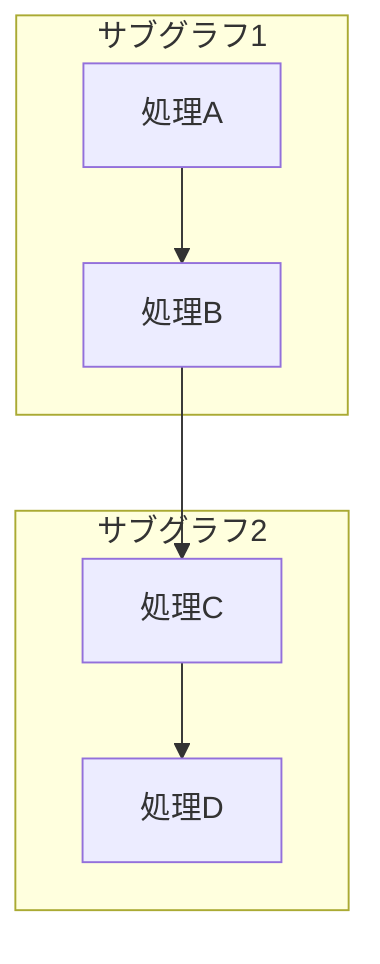

### Node Shapes
- `["テキスト"]` - Rectangle (default)
- `("テキスト")` - Rounded rectangle
- `(["テキスト"])` - Stadium shape
- `[["テキスト"]]` - Subroutine
- `[("テキスト")]` - Cylindrical shape (database)
- `{{"テキスト"}}` - Hexagon
- `{{"テキスト"}}` - Rhombus (decision)
- `>"テキスト"]` - Flag
- `(("テキスト"))` - Circle
- `((("テキスト")))` - Double circle

### Styling
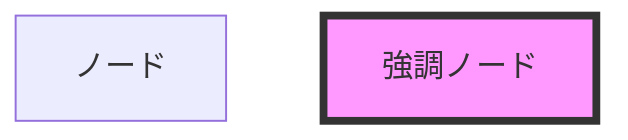

## Advanced Sequence Diagram Features

### Loops and Alternatives
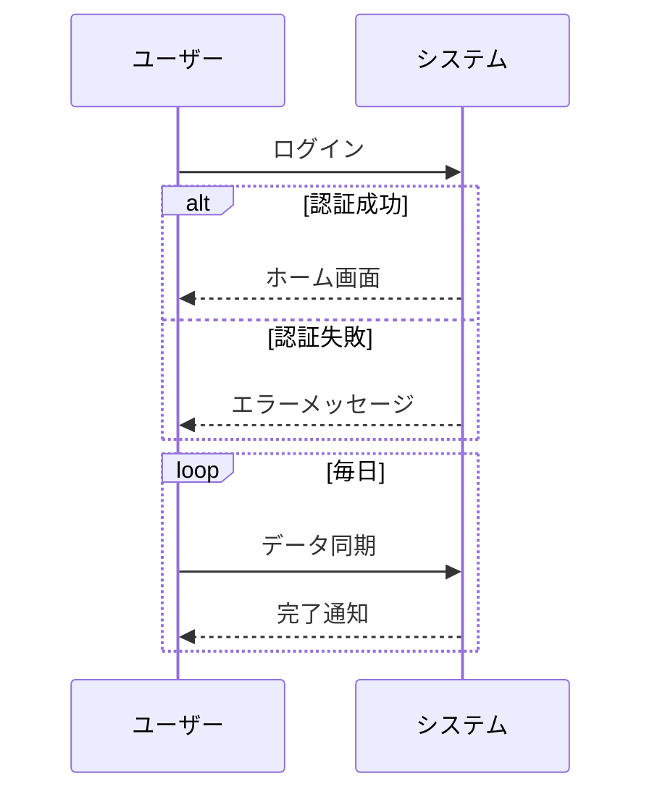

### Background Highlighting
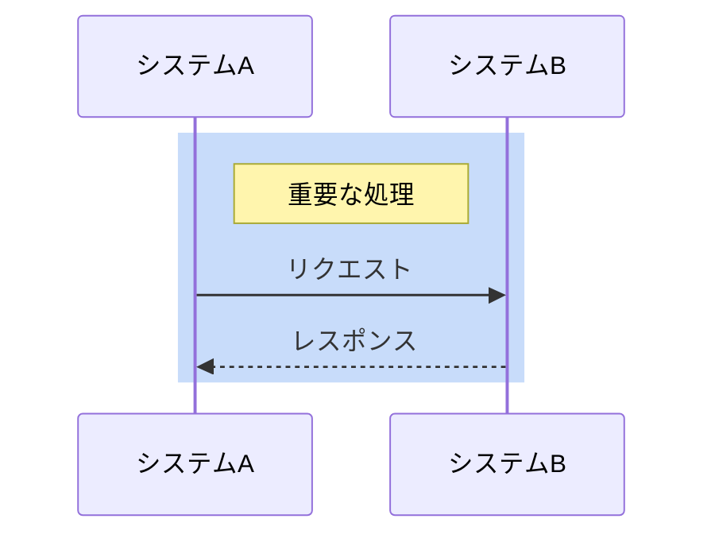

## State Diagrams

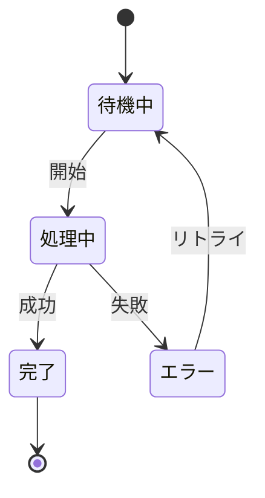

### Composite States
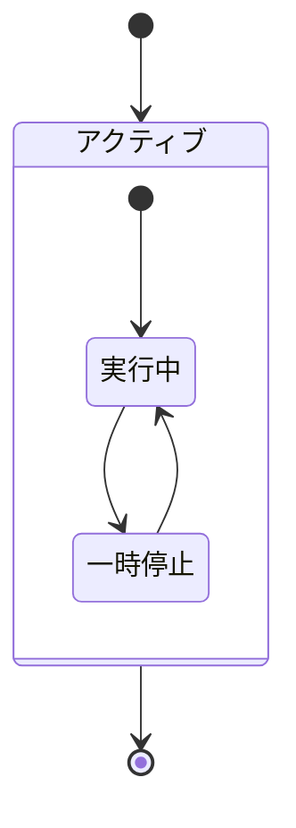

## Git Graphs

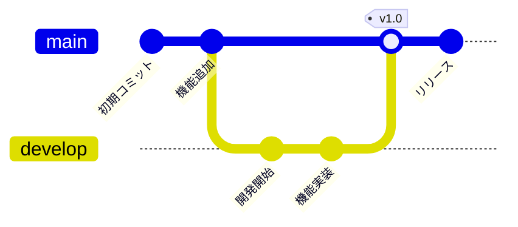

## Pie Charts

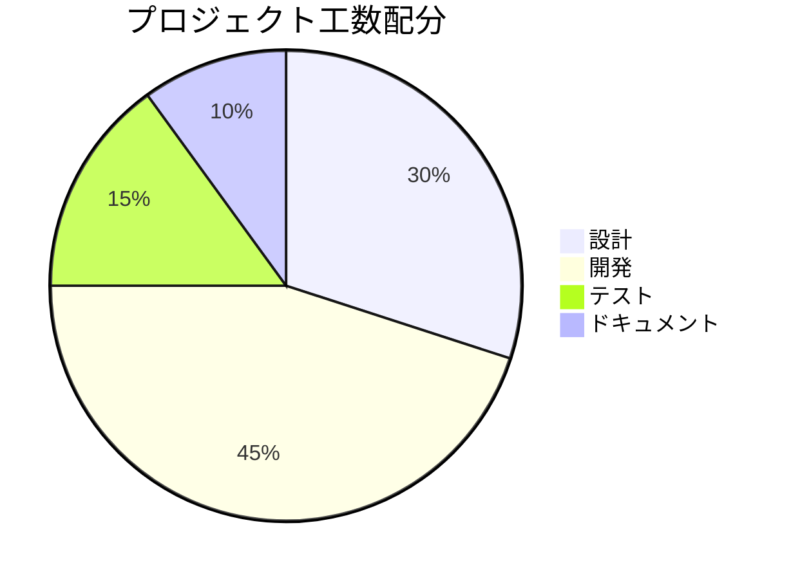

## Requirement Diagrams

```mermaid
requirementDiagram
    requirement 機能要件1 {
        id: REQ-001
        text: ユーザー認証機能
        risk: high
        verifymethod: test
    }
    
    functionalRequirement 技術要件1 {
        id: FREQ-001
        text: OAuth2.0対応
        risk: medium
        verifymethod: inspection
    }
    
    機能要件1 - contains -> 技術要件1
```

## C4 Diagrams (Context)

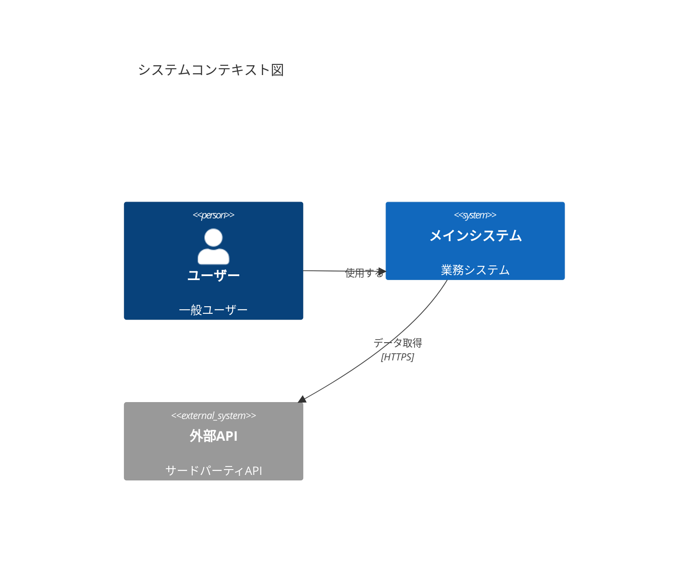

## Timeline Diagrams

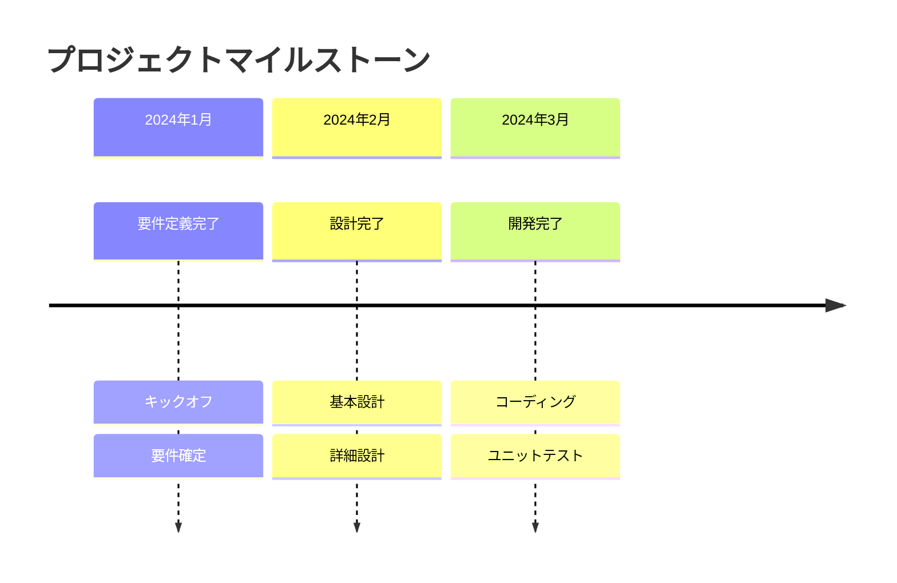

## Mind Maps

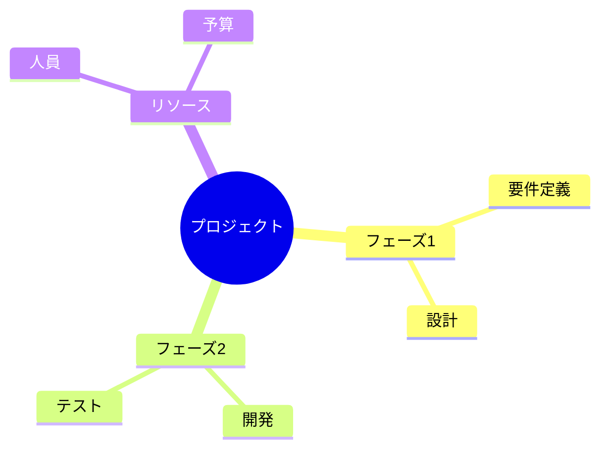

## Quadrant Charts

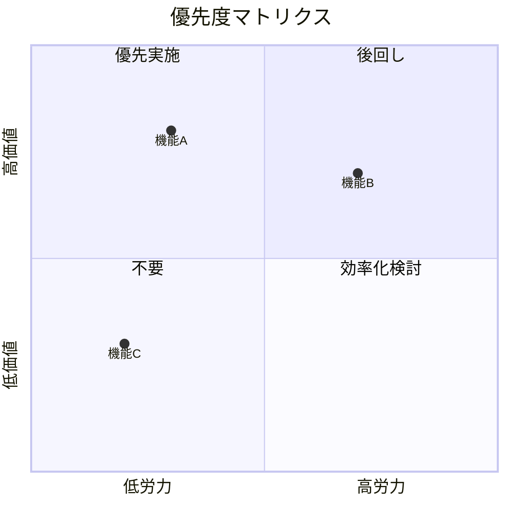

## Styling Tips

### Theme Configuration
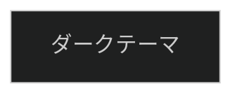

Available themes: `default`, `dark`, `forest`, `neutral`

### Custom Styles
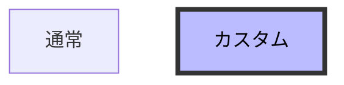

## Performance Tips

1. **Limit node count**: Keep diagrams under 50 nodes for best performance
2. **Use subgraphs**: Group related nodes to improve readability
3. **Avoid crossing lines**: Plan layout to minimize line crossings
4. **Consistent naming**: Use clear, consistent node IDs

## Debugging Tips

1. **Validate incrementally**: Add nodes/edges one at a time
2. **Check quotes**: Ensure all Japanese text uses double quotes
3. **Verify syntax**: Each diagram type has specific syntax requirements
4. **Test isolation**: Create minimal reproduction when debugging errors
5. **Use comments**: Add `%% comment` to document complex diagrams
