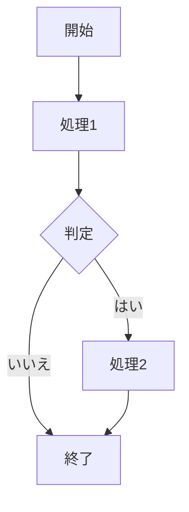
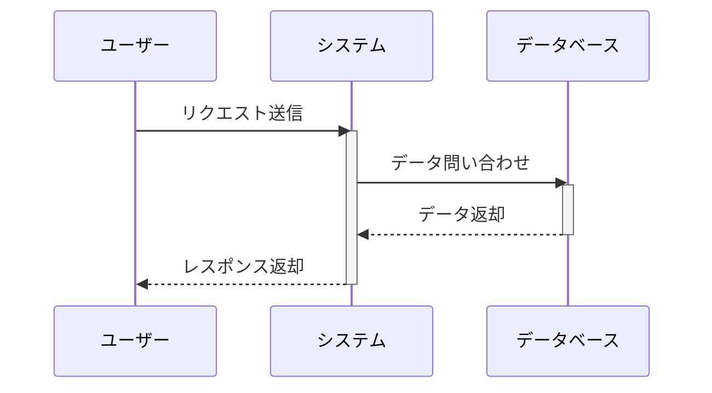
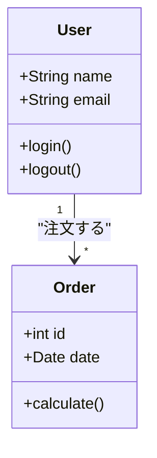
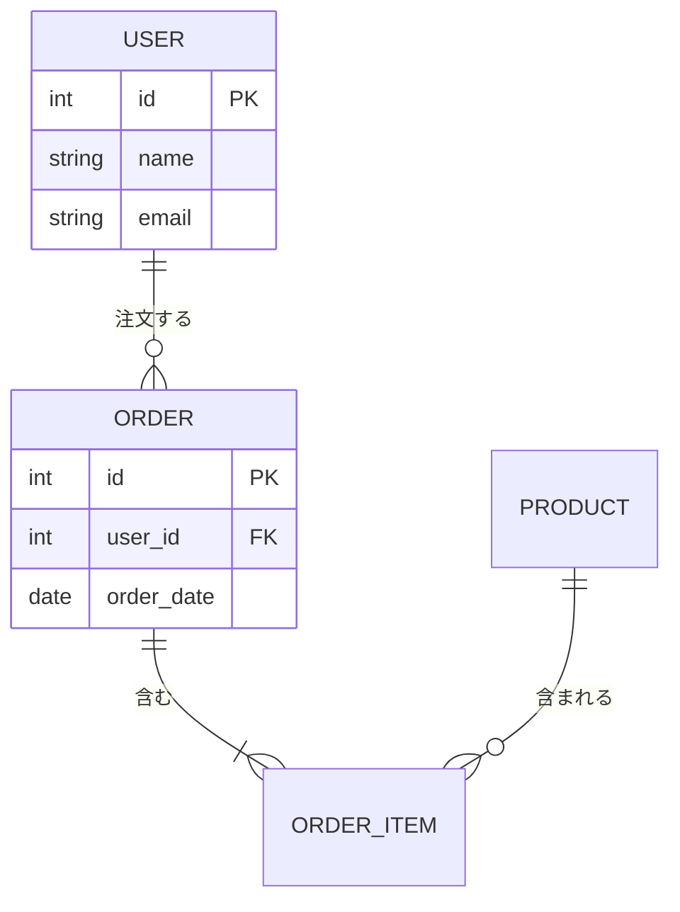
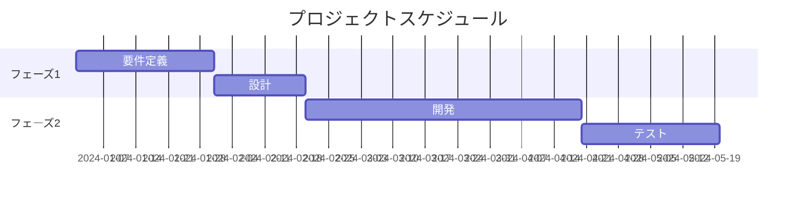
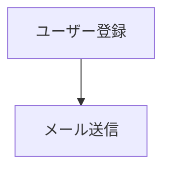
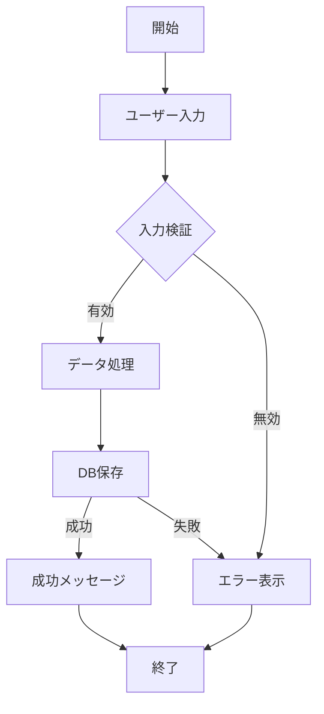

# Mermaid Diagram Creation

Create syntactically correct Mermaid diagrams, with special attention to Japanese text handling.

## Core Principles

1. **Always use double quotes for Japanese text** - Never use single quotes or backticks
2. **Avoid special characters in node IDs** - Use alphanumeric IDs only
3. **Escape quotes within labels** - Use `#quot;` or avoid nested quotes
4. **Validate arrow syntax** - Different diagram types use different arrow formats
5. **Test incrementally** - Build complex diagrams step by step

## Common Diagram Types

### Flowchart


**Key points:**
- Use `flowchart TD` (top-down) or `flowchart LR` (left-right)
- Node IDs: Simple alphanumerics (A, B, C, node1, etc.)
- Labels: Always in double quotes `["ラベル"]`
- Link labels: Use `|"ラベル"| ` format

### Sequence Diagram


**Key points:**
- Use `participant X as "日本語名"` format
- Arrow types: `->`, `->>`, `-->`, `-->>`, `-x`, `--x`
- Activate/deactivate for lifelines
- Notes: `Note over X: "テキスト"` or `Note left/right of X: "テキスト"`

### Class Diagram


**Key points:**
- Use English for class/method names (best practice)
- Japanese only in relationship labels with double quotes
- Visibility: `+` public, `-` private, `#` protected
- Relationships: `<|--` inheritance, `*--` composition, `o--` aggregation, `-->` association

### Entity Relationship Diagram


**Key points:**
- Relationship syntax: `||--o{` (one-to-many), `||--||` (one-to-one), `}o--o{` (many-to-many)
- Japanese in relationship labels only
- Field format: `type name constraints`

### Gantt Chart


**Key points:**
- Section names can be Japanese
- Task names can be Japanese
- Date format must match `dateFormat` declaration

## Critical Rules for Japanese Text

### ✅ CORRECT


### ❌ WRONG - Will cause errors
```mermaid
flowchart TD
    A['ユーザー登録']  ❌ Single quotes
    B[`メール送信`]    ❌ Backticks
    A -> B             ❌ Wrong arrow for flowchart
```

## Error Prevention Checklist

Before finalizing a diagram:

1. ✓ All Japanese text in double quotes `""`
2. ✓ Node IDs are simple (A, B, node1, etc.)
3. ✓ Correct arrow syntax for diagram type
4. ✓ No unescaped special characters in labels
5. ✓ Proper indentation (spaces, not tabs)
6. ✓ Diagram type declaration is correct

## Complex Example: Full System Flow



## Best Practices

1. **Start simple**: Create basic structure first, then add Japanese labels
2. **Use English IDs**: Keep node IDs in English, use Japanese only in display labels
3. **Test incrementally**: Add one node/connection at a time when debugging
4. **Consistent spacing**: Use consistent indentation (4 spaces recommended)
5. **Comment complex parts**: Use `%%` for comments to explain complex logic

## Workflow

1. Determine diagram type based on use case
2. Create basic structure with English IDs
3. Add Japanese labels in double quotes
4. Verify arrow syntax matches diagram type
5. Test the diagram
6. Refine and add details

## Common Errors and Fixes

| Error | Cause | Fix |
|-------|-------|-----|
| Syntax error with Japanese | Single quotes or backticks | Use double quotes `["テキスト"]` |
| Invalid node ID | Special characters in ID | Use alphanumeric IDs only |
| Wrong arrow type | Incorrect syntax for diagram | Check diagram-specific arrow format |
| Unmatched quotes | Quote inside quoted text | Use `#quot;` or restructure |
| Indentation error | Mixed tabs/spaces | Use spaces consistently |

**For detailed error patterns and solutions**: See `references/error_patterns.md` for 12 common error patterns with Japanese text and their fixes.

**For advanced features**: See `references/advanced_syntax.md` for subgraphs, styling, state diagrams, and other advanced diagram types.
