# Common Errors with Japanese Text

This reference lists common errors when using Japanese in Mermaid diagrams and how to fix them.

## Error Pattern 1: Quote Type Mismatch

### ❌ ERROR
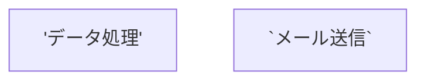

**Error message:** `Parse error on line X`

**Cause:** Using single quotes `'` or backticks `` ` `` with Japanese text

**Fix:** Always use double quotes `"`
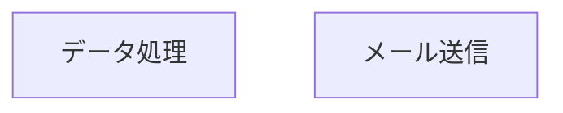

## Error Pattern 2: Special Characters in Node IDs

### ❌ ERROR
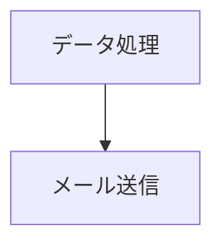

**Error message:** `Parse error` or rendering fails silently

**Cause:** Using Japanese or special characters directly as node IDs

**Fix:** Use alphanumeric IDs, put Japanese in labels


## Error Pattern 3: Wrong Arrow Syntax

### ❌ ERROR (Flowchart)
```mermaid
flowchart TD
    A["開始"]
    B["終了"]
    A -> B
```

**Error message:** Arrow not rendering correctly

**Cause:** Using sequence diagram arrow syntax `->` in flowchart

**Fix:** Use flowchart arrows `-->`
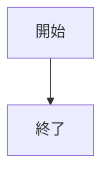

### ❌ ERROR (Sequence Diagram)
```mermaid
sequenceDiagram
    A["ユーザー"]
    B["システム"]
    A --> B: リクエスト
```

**Error message:** Parse error

**Cause:** Using flowchart arrow syntax in sequence diagram

**Fix:** Use sequence diagram arrows `->>`, `-->>`, etc.
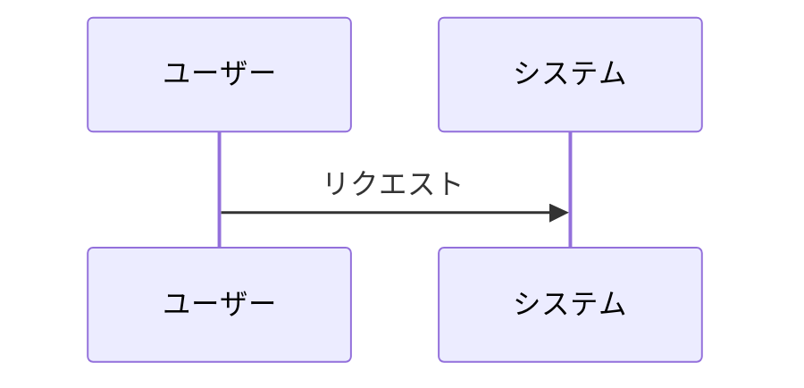

## Error Pattern 4: Nested Quotes

### ❌ ERROR
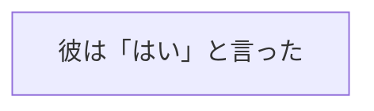

**Error message:** Parse error on quotes

**Cause:** Nested quotes breaking the syntax

**Fix 1:** Use HTML entity for inner quotes
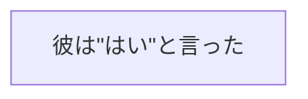

**Fix 2:** Restructure to avoid nested quotes
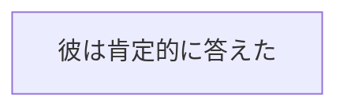

## Error Pattern 5: Missing Quotes in Links

### ❌ ERROR
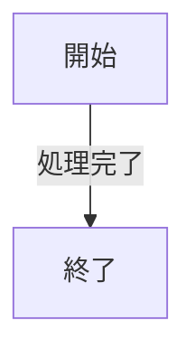

**Error message:** Link label not rendering or parse error

**Cause:** Japanese text in link label without quotes

**Fix:** Wrap link labels in quotes


## Error Pattern 6: Participant Declaration in Sequence Diagrams

### ❌ ERROR
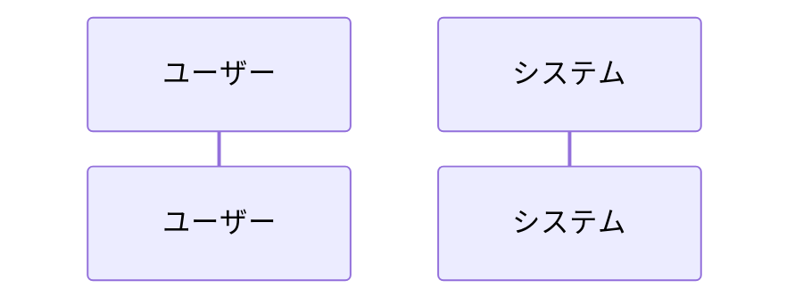

**Error message:** Parse error

**Cause:** Using Japanese directly in participant name

**Fix:** Use `as` keyword with quoted Japanese


## Error Pattern 7: Indentation Issues

### ❌ ERROR
```mermaid
flowchart TD
	A["開始"]  # Tab character
    B["終了"]  # Spaces
```

**Error message:** Unexpected indentation or parse error

**Cause:** Mixing tabs and spaces

**Fix:** Use consistent spacing (4 spaces recommended)
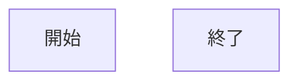

## Error Pattern 8: Missing Diagram Type Declaration

### ❌ ERROR
```mermaid
A["開始"] --> B["終了"]
```

**Error message:** Parse error

**Cause:** Missing diagram type at the start

**Fix:** Always declare diagram type


## Error Pattern 9: Incorrect Subgraph Syntax

### ❌ ERROR
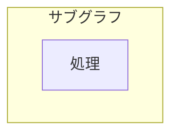

**Error message:** Parse error or rendering issue

**Cause:** Japanese text without quotes in subgraph declaration

**Fix:** Use quoted labels for subgraphs
```mermaid
flowchart TD
    subgraph sub1["サブグラフ"]
        A["処理"]
    end
```

## Error Pattern 10: Class Diagram Relationship Labels

### ❌ ERROR
```mermaid
classDiagram
    User --> Order : 注文する
```

**Error message:** Label not rendering

**Cause:** Missing quotes on relationship label

**Fix:** Quote the Japanese label
```mermaid
classDiagram
    User --> Order : "注文する"
```

## Error Pattern 11: ER Diagram Relationship Syntax

### ❌ ERROR
```mermaid
erDiagram
    USER --> ORDER : 注文する
```

**Error message:** Parse error or incorrect rendering

**Cause:** Wrong arrow syntax for ER diagrams

**Fix:** Use proper ER relationship syntax
```mermaid
erDiagram
    USER ||--o{ ORDER : "注文する"
```

## Error Pattern 12: State Diagram Transition Labels

### ❌ ERROR
```mermaid
stateDiagram-v2
    [*] --> 処理中
    処理中 --> 完了 : 成功
```

**Error message:** Parse error on transition label

**Cause:** Missing quotes on Japanese state name or transition

**Fix:** Quote Japanese text
```mermaid
stateDiagram-v2
    [*] --> 処理中
    処理中 --> 完了 : "成功"
```

## General Debugging Workflow

When encountering errors with Japanese text:

1. **Check quotes**: Verify all Japanese text uses double quotes `"`
2. **Verify node IDs**: Ensure IDs are alphanumeric only
3. **Confirm arrow syntax**: Check the syntax matches the diagram type
4. **Test incrementally**: Comment out sections to isolate the error
5. **Simplify**: Remove complexity until it works, then add back carefully
6. **Check diagram type**: Ensure the declaration matches intended diagram

## Prevention Checklist

Before finalizing any diagram with Japanese:

- [ ] All Japanese text in double quotes `""`
- [ ] Node IDs are alphanumeric (A, B, node1, etc.)
- [ ] Arrow syntax matches diagram type
- [ ] Link labels are quoted
- [ ] Participant names use `as "名前"` syntax
- [ ] Subgraph labels are quoted
- [ ] No nested quotes (or properly escaped)
- [ ] Consistent indentation (spaces, not tabs)
- [ ] Diagram type declared at top
- [ ] No special characters in structural elements
